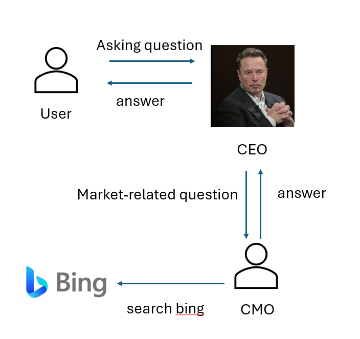
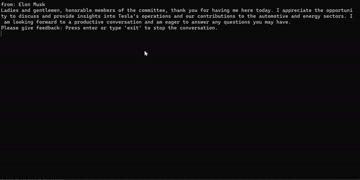

# AI Agent team

This demo shows how to use AutoGen.Net to create a virtual AI agent team that can answer questions related to Tesla.

The AI agent team is composed of 3 agents:
- `User`: This agent represents the user and raises questions to the CEO.
- `CEO`: This agent represents the CEO of Tesla and answers questions related to the company. When the question is related to marketing, the CEO forwards the question to the CMO.
- `CMO`: This agent represents the CMO of Tesla and answers questions related to marketing. It has access to bing search to find the answer to the question.

## Workflow


## How to run the demo
Firstly, set up `OPENAI_API_KEY` and `BING_API_KEY` to your environment variables.
> [!NOTE]
> To get `BING_API_KEY`, you need to create a Bing Search resource in Azure and get the key from the resource. For information on how to create a Bing Search resource, see [Create a Bing Search resource](https://www.microsoft.com/en-us/bing/apis/bing-web-search-api).
```
export OPENAI_API_KEY=<your_openai_api_key>
export BING_API_KEY=<your_bing_api_key>
```

Then, clone the repository and run the following commands:
```
dotnet run
```

## Example output
In the example below, two questions are raised from user
- What's the sales data for Q1 2024 semester?
- Can you explain the huge gap between produced number and delivered number in Q1 2024?

In the chat session, the CEO forwards the first question to CMO because it is related to marketing, who then uses Bing search to find the answer. The CEO answers the second question because it is related to the company-wide operation.

